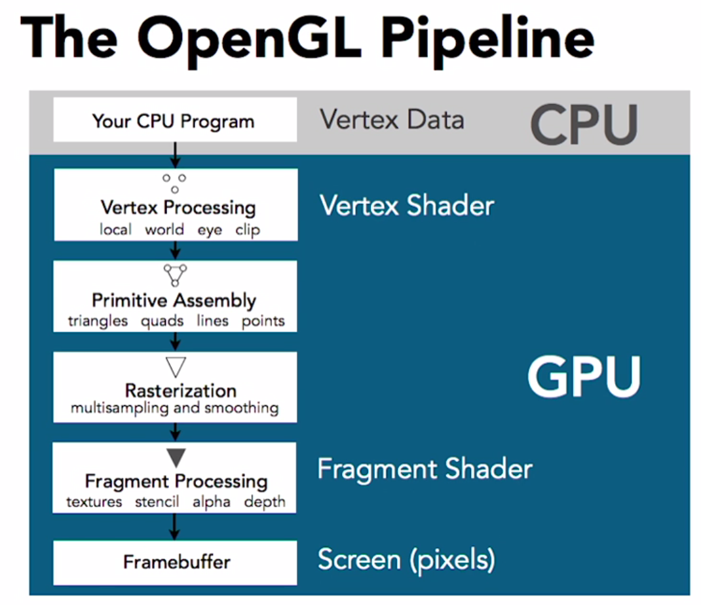

Up and Running with OpenGL
==========================

#### Setting up OpenGL and CMake in OS X
1. Download CMake: http://www.cmake.org/download/
2. cd into the CMake file directory:

          	$ ./bootstrap && make && make install
3. You may not intalled GLEW yet: http://sourceforge.net/projects/glew/files/glew/1.12.0/glew-1.12.0.tgz/download
4. cd into the GLEW ile directory: 

            $ make
            $ sudo -s make install
            $ make clean
3. Use CMake to generate an Xcode project file:

			$ mkdir xcode
			$ cd xcode
			$ cmake -G "Xcode" ..

#### Introduction to OpenGL terminology
##### A Pixel is an Area Unit of Color:
A pixel is the smallest indivisible square or rectangular region of your screen. Any pixel on our screen has a red, green, blue, and alpha component. So, when we talk about creating color, we'll talk about creating red, green, blue, and alpha values. These are usually stored as four floating-point values.

##### A VERTEX is a Set of Attributes:
A vertex, in the graphics world, is a set of attributes. At the very least, a vertex can be considered a coordinate position in space.
So, in 2D a vertex would have an X and Y coordinate. In 3D, a vertex would have an X, Y, and Z coordinate. Vertices can also have other information. As we'll see, a vertex can also have other information attached to it, such as color information or texture coordinate information or a normal direction.

##### A Frame is a Frame of Animation:
Using the GLFW Library, our code will typically run at about 60 frames per second. Using the GLFW Library, our code will typically run at about 60 frames per second.

##### A Framebuffer is an array of pixels:
This is the image that you actually see on your screen. There are two framebuffers, the front buffer and the back buffer. At any given moment, in OpenGL, you're seeing the front buffer, while the back buffer is being rendered to. We swap these buffers every frame of animation, so that the new buffer that you see was the last one to be written to. Filling these buffers is called rendering.

##### OpenGL specifies its own data types:
So, if you're a C programmer, you're familiar with int and unsigned byte and float. If we want to make sure that our GPU is receiving the same type of information, it's safe to say that if we want to send data to the GPU, we should use GL's versions of these types. So, we want to call it GLubyte or GLuint or GLfloat. Open GL will also specify enumerations for naming these types. You'll find that a lot of our functions will call for a particular data type to be specified.

