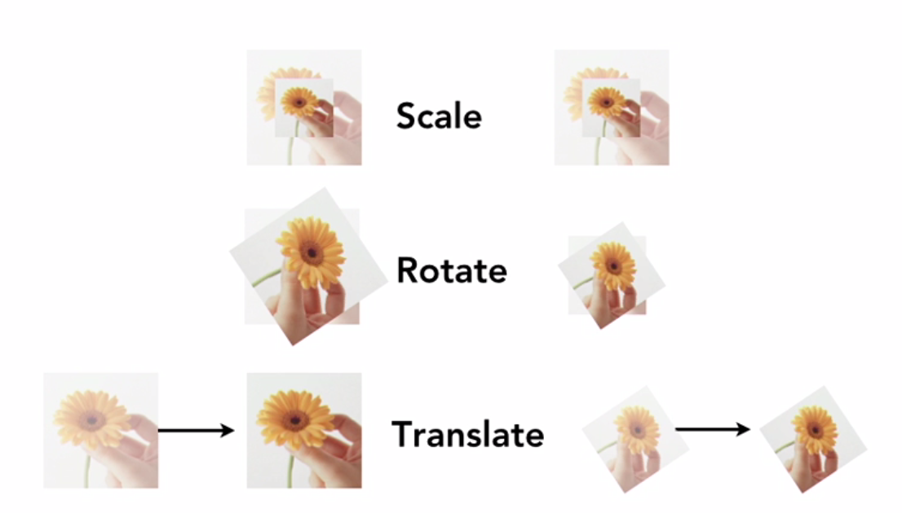

Up and Running with OpenGL
==========================

#### Setting up OpenGL and CMake in OS X
1. Download CMake: http://www.cmake.org/download/
2. cd into the CMake file directory:

            $ ./bootstrap && make && make install
3. You may not intalled GLEW yet: http://sourceforge.net/projects/glew/files/glew/1.12.0/glew-1.12.0.tgz/download
4. cd into the GLEW ile directory: 

            $ make
            $ sudo -s make install
            $ make clean
3. Use CMake to generate an Xcode project file:

            $ mkdir xcode
            $ cd xcode
            $ cmake -G "Xcode" ..

#### Introduction to OpenGL terminology
##### A Pixel is an Area Unit of Color:
A pixel is the smallest indivisible square or rectangular region of your screen. Any pixel on our screen has a red, green, blue, and alpha component. So, when we talk about creating color, we'll talk about creating red, green, blue, and alpha values. These are usually stored as four floating-point values.

##### A VERTEX is a Set of Attributes:
A vertex, in the graphics world, is a set of attributes. At the very least, a vertex can be considered a coordinate position in space.
So, in 2D a vertex would have an X and Y coordinate. In 3D, a vertex would have an X, Y, and Z coordinate. Vertices can also have other information. As we'll see, a vertex can also have other information attached to it, such as color information or texture coordinate information or a normal direction.

##### A Frame is a Frame of Animation:
Using the GLFW Library, our code will typically run at about 60 frames per second. Using the GLFW Library, our code will typically run at about 60 frames per second.

##### A Framebuffer is an array of pixels:
This is the image that you actually see on your screen. There are two framebuffers, the front buffer and the back buffer. At any given moment, in OpenGL, you're seeing the front buffer, while the back buffer is being rendered to. We swap these buffers every frame of animation, so that the new buffer that you see was the last one to be written to. Filling these buffers is called rendering.

##### OpenGL specifies its own data types:
So, if you're a C programmer, you're familiar with int and unsigned byte and float. If we want to make sure that our GPU is receiving the same type of information, it's safe to say that if we want to send data to the GPU, we should use GL's versions of these types. So, we want to call it GLubyte or GLuint or GLfloat. Open GL will also specify enumerations for naming these types. You'll find that a lot of our functions will call for a particular data type to be specified.

#### Understanding the programmable pipeline

#### Introducing shaders and the OpenGL Shading Language (GLSL)
So let's think about the GPU. We want to give it some instructions for how to transform and render whatever it is we send to it. These instructions are actually complied programs and we call them shaders.

GLSL data types exist as part of a pipeline, they're parameterized by whether they are inputs or outputs of the program:
            
            attribute - specify incoming vertex data

            varying - interpolatable varying properties passed along to next process, which are passed from the vertex processor onto the fragment processor

            uniforms - which are properties typically shared by all vertices on some primitive

As for the data types themselves:
            
            vec2 - a two-dimensional vector

            vec3 - a three-dimensional vector

            vec4 - a four-dimensional vector (e.g. a homogenized vec3)

            mat2 - a 2 x 2 matrix

            mat3 - a 3 x 3 matrix

            mat4 - a 4 x 4 matrix

A GLSL program has to have a main function:
            
            void main(void) {} - required function of a shader

            gl_Position - required final calculated vertex position, we have to set the variable gl_Position at some point in the vertex processing stage

            gl_FlagColor - required final calculated pixel color, we have to set the variable gl_FragColor at some point in the fragment processing stage

#### Vertex Array Objects & Vertex Buffer Objects
We exchange data with the GPU with vertex buffer objects. We exchange data with the GPU about where those buffer objects are with vertex array objects.

We tell the GPU how to navigate that data with vertex attribute pointers. The vertex array object allows us to find a particular number, a "glu int" to a whole set of data on the GPU. On the CPU side, we can refer to a whole buffer of data on the GPU by just binding this particular number. The vertex array object is a number which represents a whole set of vertex data.

The first step is to assign our position ID to the address of our position variable in our shader source code

The second step will be to assign our array ID to a new vertex array object

The third step will be to assign our buffer ID to the actual buffer of data that we send over to the GPU

Finally, we're going to tell the GPU how to navigate the data we've sent to it by specifying the type of data we've sent and the stride between each data block

If our vertex array object is the glue between our shader and our vertex data on the GPU, and our attribute pointer is how to navigate that data, then our vertex buffer object is the data itself.

#### Introducing matrix transformations:
1. We can scale, rotate or translate vertex positions.

2. We can remap them to different coordinate system.

3. We can project them onto screen.

#### Using Model, View, and Projection matrices:
Model transformation matrix can do three things to our vertices:

1. It can scale vertices, relative to the origin.

1. It can rotate vertices, relative to the origin.

2. it can translate vertices, relative to the origin.

